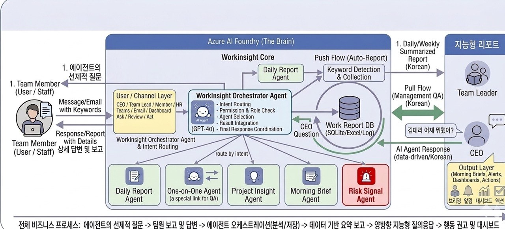
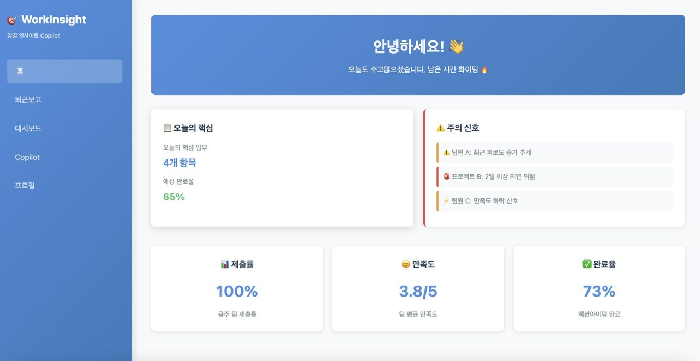
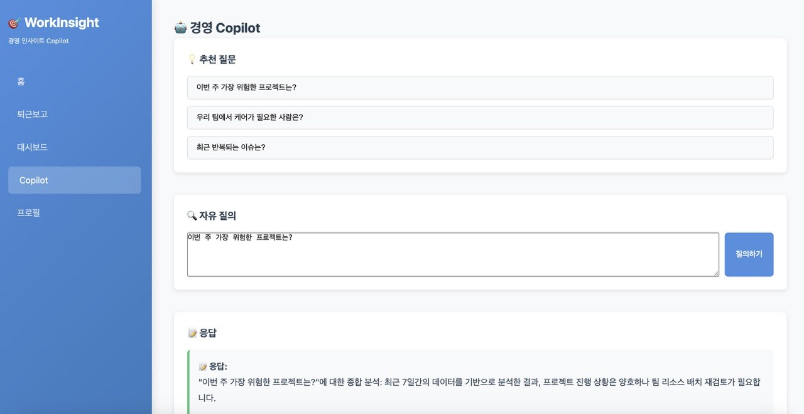
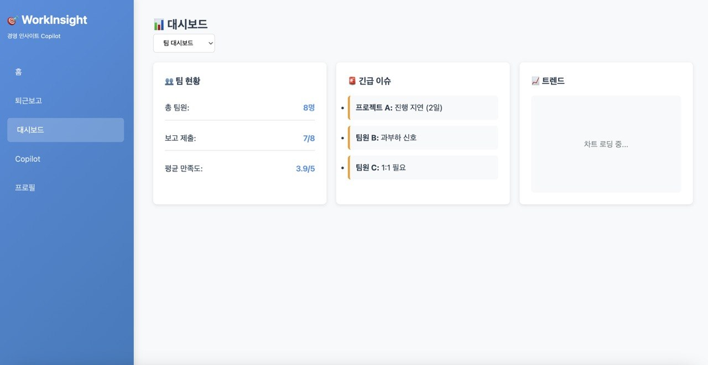

# WorkInsight - 경영 인사이트 Copilot MVP

퇴근보고, 1:1 상담, 프로젝트 진행 데이터를 기반으로 대표와 팀장이 조직 상태를 파악하고, 매일 실행 우선순위를 받고, 궁금한 것을 직접 질문할 수 있는 경영지원 에이전트입니다.


## 개념도




## 프로젝트 구조

```
work-insight/
├── backend/                 # FastAPI 백엔드
│   ├── app/
│   │   ├── models/         # SQLAlchemy ORM 모델
│   │   ├── schemas/        # Pydantic 스키마
│   │   ├── api/            # API 라우터
│   │   │   ├── reports.py          # 퇴근보고 API
│   │   │   ├── oneone.py           # 1:1 상담 API
│   │   │   ├── dashboard.py        # 대시보드 API
│   │   │   ├── copilot.py          # Copilot 질의 API
│   │   │   └── email_storage.py    # SharePoint 저장 / Graph 웹훅 API
│   │   ├── services/       # 비즈니스 로직
│   │   │   ├── microsoft_graph.py          # Graph API 토큰 및 HTTP 클라이언트
│   │   │   ├── sharepoint_email_storage.py # SharePoint 리스트 저장 서비스
│   │   │   ├── graph_email_ingestion.py    # Graph 구독 생성 및 웹훅 처리
│   │   │   └── email_service.py            # 이메일 유틸리티
│   │   ├── analysis/       # AI/분석 엔진
│   │   │   ├── analyzer.py   # ReportAnalyzer, RiskSignalDetector, BriefingGenerator
│   │   │   └── copilot.py    # CopilotEngine (오케스트레이터 연동 포함)
│   │   ├── utils/          # 공통 유틸리티
│   │   └── main.py         # FastAPI 앱 진입점
│   └── config.py           # 설정 파일
├── frontend/               # 정적 웹 UI (HTML + Vanilla JS)
├── docs/                   # 문서
├── requirements.txt        # Python 패키지 의존성
└── README.md
```

## 주요 모듈

### 1. 퇴근보고 (Daily Report)
- 팀원이 매일 작성하는 퇴근보고 관리
- 자동 분류 및 분석 (프로젝트 태깅, 이슈 추출, 감정 분석)

### 2. 1:1 상담 (One-on-One)
- 팀장-팀원 상담 기록 관리
- 액션아이템 추적
- 민감정보 접근 제어

### 3. 대시보드 (Dashboard)
- 팀장용: 팀원별 업무 현황, 미완료 누적, 반복 이슈
- 대표용: 전사 프로젝트 진행, 지연 위험, 조직 피로도

### 4. RAG 기반 Copilot
- 자연어 질의 처리
- Azure AI Orchestration Agent 연동 (로컬 fallback 포함)
- 근거 포함 답변 생성

### 5. 아침 브리핑
- 자동 생성 및 이메일 발송
- 대상별 맞춤 콘텐츠

### 6. 리스크 신호 탐지
- 이탈 리스크, 번아웃, 갈등 신호 감지
- 조기 경고 및 추천 액션

### 7. 이메일 수신 → SharePoint 저장
- Microsoft Graph 구독(webhook)으로 수신 이메일 자동 캡처
- SharePoint `RawWorkReports` 리스트에 이메일 내용 저장
- 저장 필드: `Title`, `Sender`, `ReportContent`, `ReceivedTime`, `AISummary`

## 설치 및 실행

### 1. 패키지 설치
```bash
pip install -r requirements.txt
```

### 2. 환경 변수 설정
루트에 `.env` (또는 `.env.sharepoint`) 파일 생성 후 아래 **환경 변수 설정** 섹션 참고.

### 3. 서버 실행
```bash
cd backend
copy ..\<env파일> .env
python -m uvicorn app.main:app --port 8000
```

API 문서: http://localhost:8000/docs

### 4. 프론트엔드 실행
```bash
cd frontend
python -m http.server 3000
```

> 프론트엔드는 현재 목업 데이터로 동작합니다. 백엔드 실제 연동을 위해서는 `frontend/js/api.js`의 fetch 경로를 활성화하세요.

## 핵심 API 엔드포인트

### 퇴근보고
- `POST /api/reports/` - 퇴근보고 작성
- `GET /api/reports/my/` - 내 보고 목록
- `GET /api/reports/{report_id}` - 보고 조회
- `GET /api/reports/stats/risk` - 리스크 통계

### 1:1 상담
- `POST /api/oneone/` - 상담 기록
- `GET /api/oneone/{record_id}` - 상담 조회
- `POST /api/oneone/{oneone_id}/action-items` - 액션 아이템 생성
- `PATCH /api/oneone/action-items/{item_id}/complete` - 액션 완료 처리

### 대시보드
- `GET /api/dashboard/overview` - 전사 개요
- `GET /api/dashboard/team/{team_id}` - 팀 대시보드
- `GET /api/dashboard/org/` - 전사 대시보드

### Copilot
- `POST /api/copilot/query` - 자연어 질의 (Azure AI Orchestrator 우선 호출)
- `GET /api/copilot/suggestions` - 추천 질문
- `GET /api/copilot/history` - 질의 히스토리
- `POST /api/copilot/feedback` - 답변 피드백

### 이메일 수신 및 SharePoint 저장
- `GET /api/email-storage/sharepoint/status` - SharePoint 연결 상태 확인
- `POST /api/email-storage/sharepoint/store` - 이메일 수동 저장
- `POST /api/email-storage/graph/subscriptions` - Graph 메일 구독 생성
- `POST /api/email-storage/graph/webhook` - Graph 웹훅 수신 처리

## RAG Checkpoint 사용

RAG 처리 과정에서 검색/분석 단계를 재현하기 위해 checkpoint를 사용합니다.

### 목적
- 질의별 검색 결과를 동일 조건으로 재실행
- 분석 결과 회귀(regression) 확인
- 운영 이슈 발생 시 특정 시점 상태 복원

### 저장 내용
- 질의 원문과 의도 분류 결과
- 검색된 문서 ID 목록과 점수
- 근거(evidence) 요약 결과
- 후속 질문 생성 결과

### 운영 방식
- 질의 처리 완료 시 checkpoint를 생성
- 동일 질의 재실행 시 checkpoint와 현재 결과를 비교
- 차이가 큰 경우 로그에 경고를 남겨 품질 저하를 추적

### 권장 사항
- 배포 단위(예: release tag)로 checkpoint 스냅샷 보관
- 민감정보가 포함된 원문/근거는 마스킹 후 저장
- 장애 분석용 checkpoint는 보관 기간 정책(예: 30일)을 적용

## 개발 로드맵

### MVP Phase 1
- ✅ 기본 데이터 모델
- ✅ 퇴근보고 입력/조회
- ✅ 1:1 상담 관리
- ✅ 기본 대시보드
- ✅ RAG 기반 Copilot
- ✅ 리스크 신호 탐지
- ✅ Microsoft Graph 클라이언트 (토큰 + HTTP)
- ✅ SharePoint 이메일 저장 서비스
- ✅ Graph 웹훅 수신 및 메일 자동 저장
- ✅ Azure AI Orchestration Agent 연동 (fallback 포함)
- 🚀 아침 브리핑 발송

### Phase 2
- 인증·권한 도입 (하드코딩된 user_id 제거)
- 메모리 저장소 → 실제 DB 전환
- Graph 웹훅 구독 자동 갱신
- 고급 분석 및 트렌드
- 멀티언어 지원

## 환경 변수 설정

`backend/.env` 파일 생성:

```env
# Microsoft Graph / Azure AD
MICROSOFT_TENANT_ID=
MICROSOFT_CLIENT_ID=
MICROSOFT_CLIENT_SECRET=

# SharePoint
SHAREPOINT_SITE_ID=
SHAREPOINT_LIST_ID=

# Graph 웹훅
GRAPH_MAILBOX_USER_ID=
GRAPH_NOTIFICATION_URL=
GRAPH_SUBSCRIPTION_CLIENT_STATE=
GRAPH_SUBSCRIPTION_RESOURCE=
GRAPH_SUBSCRIPTION_EXPIRATION_MINUTES=4230

# Azure AI Orchestration Agent
ORCHESTRATION_USER_ENDPOINT=
ORCHESTRATION_API_KEY=
ORCHESTRATION_TIMEOUT_SECONDS=20
```

> `.env` 파일은 `.gitignore`에 포함되어 있습니다. 시크릿 값은 절대 커밋하지 마세요.

## 페차쿠차 발표 요약 (20x20)

WorkInsight의 기획 방향과 구조를 20장 슬라이드로 정리한 내용입니다.

### 문제 정의 (슬라이드 1–3)
- **보고는 있지만 해석이 없다** — 조직에는 퇴근보고·회의·메신저 등 정보가 충분히 있지만, 대표·팀장이 원하는 것은 "지금 어디가 막히고 어디에 개입해야 하는가"다.
- **관리자는 늘 늦게 안다** — 피로도 누적, 협업 병목, 지연 신호는 텍스트에 먼저 나타나지만 구조화되지 않아 늦게 인지된다.
- **프로젝트 리스크 ↔ 사람 리스크는 연결돼 있다** — 일정 지연은 과부하·의사결정 지연·협업 갈등에서 비롯된다.

### 핵심 기능 5가지 (슬라이드 4–10)
| 기능 | 핵심 메시지 |
|------|------------|
| 퇴근보고 구조화 | 완료/진행/미완료/지원 요청을 자동 분류해 내일의 판단 정보로 전환 |
| 1:1 상담 실행화 | 불만·성장 니즈·협업 문제를 구조화해 액션아이템으로 연결 |
| 오전 브리핑 | 전날 데이터를 대표·팀장·팀원별 맞춤 우선순위로 자동 생성 |
| 리스크 신호 탐지 | 퇴사 예측이 아닌 피로도·갈등·번아웃 조기 케어 신호 감지 |
| RAG 기반 경영 질의 | "이번 주 가장 위험한 프로젝트는?" 같은 질문에 근거 기반 답변 |

- **입력 부담 최소화** — 퇴근보고, 1:1, 메일, Teams, SharePoint 등 기존 데이터 흐름 재활용

### 아키텍처 (슬라이드 11–15)
- **인터페이스**: Teams 질의 + 이메일 브리핑 + 대시보드 상세 조회
- **Orchestrator Agent**: 질문 의도 분류 → 권한 확인 → 전문 에이전트 조합 → 통합 답변
- **전문 에이전트 분리**: Daily Report / One-on-One / Project Insight / Morning Brief / Risk Signal / Mail Agent
- **Azure 기반**: Entra ID, Azure OpenAI, Azure AI Search, App Service, Key Vault 조합으로 보안·권한·M365 연동 충족
- **SharePoint·메일 연결**: 권한 기반 검색 + 민감정보 통제 전제로 RAG 지식 소스 확장

### 차별점과 로드맵 (슬라이드 16–20)
- **해석 → 실행 연결**: 리스크 감지 시 조치 제안, 브리핑에 우선순위 포함, 질의 답변에 근거 + 행동 제안 동시 제공
- **MVP 우선순위**: 퇴근보고 수집 → 대시보드 → 오전 브리핑 → 기본 리스크 → 질의응답 순으로 검증
- **성공 조건**: 기술 스택보다 입력 UX·권한 설계·설명 가능한 답변·감사 가능성이 우선
- **장기 비전**: 프로젝트 운영·조직 건강도·의사결정 지원까지 통합하는 회사 운영 OS

> 핵심 가치: 더 많은 데이터가 아니라 **더 빠르고 정확한 경영 판단**


## UI/UX 설계

<p align="center">
  
  <br/><br/>
  
  <br/><br/>
  
</p>
